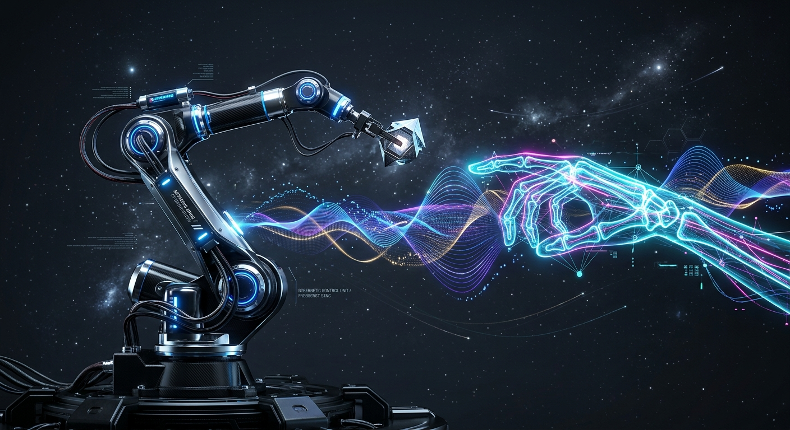

# Imitation Learning by Voice and Camera Gesture

**Powering Next-Generation Edge Robotic Control with Gemini Nano Multimodal models for raw local audio waveforms and real-time physical hand joint VLM (Vision-Language-Model) gating.**

---

<p align="center">
  
</p>

# 🎙️ **VOICE (VOI)** & 👁️ **CAMGEST**

This application implements a high-fidelity, interactive **Imitation Learning & Teleoperation Simulator** using the Franka Emika Panda 7-DOF robotic arm. By pairing continuous human voice demonstrations (**VOICE (VOI)**) with computer-vision-based hand skeleton analysis (**CAMGEST**), operators can safely train, record, and execute complex industrial pick-and-place trajectories.

---

## ⚡ Key Architectural Modules

### 1. 🎙️ **VOICE (VOI)** — High-Performance Speech Engine
The **VOICE (VOI)** system intercepts raw auditory inputs and parses physical robotic directives instantly.
- **Micro-displacements**: Captures verbal expressions such as `"up"`, `"down"`, `"left"`, `"right"`, `"forward"`, `"back"`, `"open"`, or `"close"`.
- **Dynamic Telemetry Injection**: Bypasses legacy cloud pipelines to translate consecutive spoken instructions into immediate delta-displacements on the end-effector.
- **Robust Connection Monitoring**: Relays exact audio stream states directly into the real-time coordinator.

### 2. 👁️ **CAMGEST** — Hand Skeletal tracking pipeline
The **CAMGEST (Camera Gesture)** tracking engine tracks high-fidelity skeleton vectors in real-time, providing immediate visual imitation signals.
- **Accurate Skeletal Framing**: Implements Google MediaPipe hand mesh tracking across 21 joint nodes.
- **Embedded Webcam Eye Feed**: Operators can see progress in the inline webcam feed, checking if their gestures lie safely within the camera's spatial limits.
- **Intuitive Gestural Command Library**:
  - ☝️ **Index finger up (Pointing)**: Elevates the End-Effector (`Move Up` action).
  - ✊ **Fist Closed**: Securely clamps down the robot gripper (`Close Gripper`).
  - 🤏 **Pinch (Index tip touches Thumb tip)**: Fine proximity gripping (`Close Gripper`).
  - ✋ **Hand Fully Open**: Releases gripper tension (`Open Gripper`).
  - 👇 **Index Finger Curved Downward**: Lowers the End-Effector (`Move Down` action).

### 3. 🧠 Multimodal Edge AI Compiler
Operators can type loosely structured natural-language goals (e.g., *"Lift the gripper up by 15 units, slide to the left where the yellow cube resides, and close the pinchers"*). A specialized chain-of-thought compiler translates the command into a sequence of executable physical action steps.

### 4. 🎛️ Infinite Run-Loop Teleop Status Coordinator
A modern, persistent bar at the bottom of the viewport monitors all active systems, tracking audio and vision streams and printing current gestures, voice keywords, and telemetry statuses with timestamps instantly.

---

## 🚀 Step-by-Step Setup

1. **Environmental Variables**: Set up a custom workspace key inside `.env` based on the `.env.example` template:
   ```env
   VITE_GEMINI_API_KEY=your_actual_api_key_here
   ```
2. **Offline Hardware Access**: Click both the **Microphone** and **Hand Gestures** icons in the header to permit hardware capture.
3. **Webcam Orientation**: Align your hand inside the webcam viewer to begin skeletally tracking coordinate transformations.
